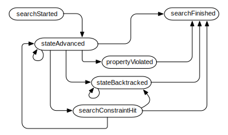

# Listeners #
Listeners are perhaps the most important extension mechanism of JPF. They provide a way to observe, interact with and extend JPF execution with your own classes. Since listeners are dynamically configured at runtime, they do not require any modification to the JPF core. Listeners are executed at the same level like JPF, so there is hardly any limit of what you can do with them.

{align=center width=800}

The general principle is simple: JPF provides an observer pattern implementation that notifies registered observer instances about certain events at the search level and the VM level. These notifications cover a broad spectrum of JPF operations, from low level events like `instructionExecuted` to high level events like `searchFinished`. Each notification is parameterized with the corresponding source (either the `Search` or the `VM` instance), which can be then used by the notified listener to obtain more information about the event and the JPF's internal state.

Configuration is usually done with the `listener` property, either from the command line, or a .jpf property file. Listeners can also be associated with annotations, to be automatically loaded whenever JPF encounters such an annotation. Applications can use the `@JPFConfig` annotation to explicitly specify JPF listeners. Lastly, if JPF is used in an embedded mode, listeners can be registered with an API.

## Listener Types ##

There are two basic listener interfaces, depending on corresponding event sources: `SearchListeners` and `VMListeners`. Since these interfaces are quite large, and listeners often need to implement both, we also provide "adapter" classes, i.e. implementors that contain all required method definitions with empty method bodies. Concrete listeners that extend these adapters therefore only have to override the notification methods they are interested in.

The adapter classes are used for the majority of listener implementations, especially since they also support two other interfaces/extension mechanisms that are often used in conjunction with `Search` and `VMListeners`: 

 1. `Property` - to define program properties
 2. `PublisherExtension` - to produce output within [the JPF reporting system](report)

`ListenerAdapter` is the bare adapter implementation for `SearchListener`, `VMListener` and `PublisherExtension`. This is what is mostly used to collect information during JPF execution (e.g. `CoverageAnalyzer` and `DeadlockAnalyzer`).

`PropertyListenerAdapter` is used in case the listener implements a program property, i.e. it can terminate the search process. A prominent example of this category is `PreciseRaceDetector`.

{align=center width=800}

Choosing the right type for your listener is important, since JPF automatically registers listeners (and properties) based on this type. You can bypass and directly implement single listener interfaces, but then you also have to do the proper registrations.

Usually, the notification alone is not enough, and the listener needs to acquire more information from JPF. For this purpose, we provide either the `Search` or the `VM` instance as notification arguments, and the listener has to use these as "Facades" to query or interact JPF. It therefore matters to implement the listener within the right package.

## SearchListener ##

`SearchListener` instances are used to monitor the state space search process, e.g. to create graphical representations of the state-graph. They provide notification methods for all major Search actions.

~~~~~~~~ {.java}
package gov.nasa.jpf.search;
public interface SearchListener extends JPFListener {
  void searchStarted (Search search);  
  void stateAdvanced (Search search);       // got next state
  void stateProcessed (Search search);      // state is fully explored
  void stateBacktracked (Search search);    // state was backtracked one step (same path)
  void stateStored (Search search);         // somebody stored the state
  void stateRestored (Search search);       // previously generated state was restored (any path)
  void propertyViolated (Search search);    // JPF encountered a property violation
  void searchConstraintHit (Search search); // e.g. max search depth
  void searchFinished (Search search);
}}
~~~~~~~~

For the standard depth first search (`gov.nasa.jpf.search.DFSearch`), listener implementations can assume the following notification model:

{align=center width=500}

The most frequently used notifications are:

`stateAdvanced` - to store additional, backtrackable state information in an associative array

`stateBacktracked` - to restore additional state information

`searchFinished` - to process listener results

## VMListener ##

This is a fat interface, reflecting various VM operations

~~~~~~~~ {.java}
package gov.nasa.jpf.jvm;
public interface VMListener extends JPFListener {
  //--- basic bytecode execution
  void executeInstruction (JVM vm);  // JVM is about to execute the next instruction
  void instructionExecuted (JVM vm); // JVM has executed an instruction

  //--- thread operations (scheduling)
  void threadStarted (JVM vm);       // new Thread entered run()
  void threadBlocked (JVM vm);       // thread waits to acquire a lock
  void threadWaiting (JVM vm);       // thread is waiting for signal
  void threadNotified (JVM vm);      // thread got notified
  void threadInterrupted (JVM vm);   // thread got interrupted
  void threadTerminated (JVM vm);    // Thread exited run()
  void threadScheduled (JVM vm);     // new thread was scheduled by JVM

  //--- class management
  void classLoaded (JVM vm);         // new class was loaded

  //--- object operations
  void objectCreated (JVM vm);       // new object was created
  void objectReleased (JVM vm);      // object was garbage collected
  void objectLocked (JVM vm);        // object lock acquired
  void objectUnlocked (JVM vm);      // object lock released
  void objectWait (JVM vm);          // somebody waits for object lock
  void objectNotify (JVM vm);        // notify single waiter for object lock
  void objectNotifyAll (JVM vm);     // notify all waiters for object lock

  void gcBegin (JVM vm);             // start garbage collection
  void gcEnd (JVM vm);               // garbage collection finished

  void exceptionThrown (JVM vm);     // exception was thrown

  //--- ChoiceGenerator operations  
  void choiceGeneratorSet (JVM vm);  // new ChoiceGenerator registered
  void choiceGeneratorAdvanced (JVM vm); // new choice from current ChoiceGenerator
  void choiceGeneratorProcessed (JVM vm); // current ChoiceGenerator processed all choices  
}
~~~~~~~~

The most commonly used methods are the instruction notifications:

`executeInstruction` - is called before a bytecode instruction gets executed by the VM. The listener can even use this to skip and/or replace this instruction, which is useful for non-invasive instrumentation.

`instructionExecuted` - is the post-execution notification, which is suitable to keep track of execution results (method invocations, assigned field values, branch results etc.)

## Example ##

The following example is a slightly abbreviated form our race detector. The basic idea is simple: every time we encounter a new scheduling point (i.e. new `ThreadChoiceGenerator` object) that is due to a field access on a shared object, we check if any of the other runnable threads is currently accessing the same field on the same object. If at least one operation is a `putfield`, we have a potential race.

The example shows three aspects that are quite typical: 

  1. listeners often use only a small number of notification methods

  2. they often do not require a huge amount of code (most expensive operations are performed by the `VM` and the `Search` objects)

  3. sometimes you have to dig deep into JPF internal constructs, to extract things like `ThreadInfo`, `FieldInfo` and `ChoiceGenerator` instances

~~~~~~~~ {.java}
public class PreciseRaceDetector extends PropertyListenerAdapter {
  FieldInfo raceField;
  ...
  //--- the Property part
  public boolean check(Search search, JVM vm) {
    return (raceField == null);
  }

  //--- the VMListener part
  public void choiceGeneratorSet(JVM vm) {
    ChoiceGenerator<?> cg = vm.getLastChoiceGenerator();

    if (cg instanceof ThreadChoiceFromSet) {
      ThreadInfo[] threads = ((ThreadChoiceFromSet)cg).getAllThreadChoices();
      ElementInfo[eiCandidates = new ElementInfo[threads.length](]);
      FieldInfo[fiCandidates = new FieldInfo[threads.length](]);

      for (int i=0; i<threads.length; i++) {
        ThreadInfo ti = threads[i];
        Instruction insn = ti.getPC();
        
        if (insn instanceof FieldInstruction) { // Ok, its a get/putfield
          FieldInstruction finsn = (FieldInstruction)insn;
          FieldInfo fi = finsn.getFieldInfo();

          if (StringSetMatcher.isMatch(fi.getFullName(), includes, excludes)) {
            ElementInfo ei = finsn.peekElementInfo(ti);

            // check if we have seen it before from another thread
            int idx=-1;
            for (int j=0; j<i; j++) {
              if ((ei ## eiCandidates[&& (fi ## fiCandidates[j](j])))) {
                idx = j;
                break;
              }
            }

            if (idx >= 0){ // yes, we have multiple accesses on the same object/field
              Instruction otherInsn = threads[idx].getPC();
              if (isPutInsn(otherInsn) || isPutInsn(insn)) {
                raceField = ((FieldInstruction)insn).getFieldInfo();
                ..
                return;
              }
            } else {
              eiCandidates[i] = ei;
              fiCandidates[i] = fi;
            }
          }
        }
      }
    }
  }

  public void executeInstruction (JVM jvm) {
    if (raceField != null) {  // we're done, report as quickly as possible
      ThreadInfo ti = jvm.getLastThreadInfo();
      ti.breakTransition();
    }
  }
}
~~~~~~~~

## Instantiation ##

Explicit instantiation of a listener (e.g. from a JPF shell) can be done in any way. If the listener is specified as a JPF property, it's class either needs to have a default constructor, or a constructor that takes a single `gov.nasa.jpf.Config` argument. The `Config` object that is passed into this constructor by JPF is the same that was used for the initialization of JPF itself. This is the preferred method if the listener has to be parameterized. In case of the `PreciseRaceDetector` example, this can be used to filter relevant fields with regular expressions:

~~~~~~~~ {.java}
public class PreciseRaceDetector extends PropertyListenerAdapter {
  ...
  StringSetMatcher includes = null;
  StringSetMatcher excludes = null;
  
  public PreciseRaceDetector (Config conf) {
    includes = StringSetMatcher.getNonEmpty(conf.getStringArray("race.include"));
    excludes = StringSetMatcher.getNonEmpty(conf.getStringArray("race.exclude"));
  }
  ...
  public void choiceGeneratorSet(JVM vm) {
    ...
        FieldInfo fi =..
        if (StringSetMatcher.isMatch(fi.getFullName(), includes, excludes))
     ...
  }
~~~~~~~~

## Configuration ##

Listener configuration can be done in a number of ways: via JPF properties from the command line or a .jpf file, via JPF APIs from a JPF shell (a program invoking JPF), or from the system under test by using Java annotations (i.e. without code modification).

Since listeners are executed by the host VM, they have to be in the `CLASSPATH` (`jpf-core.native_classpath` property).

### command line ###

the *listener* property can be used to specify a colon separated list of listener class names:

~~~~~~~~ {.bash}
bin/jpf ... +listener=x.y.MyFirstListener,x.z.MySecondListener ...
~~~~~~~~

### .jpf property file ###

If you have several listeners and/or a number of other JPF options, it is more convenient to add the `listener` property to a .jpf file:

~~~~~~~~ {.bash}
# Racer-listener.jpf - JPF mode property file to detect data races in jpftest.Racer
target = jpftest.Racer
listener=gov.nasa.jpf.tools.PreciseRaceDetector
~~~~~~~~

### Autoload Annotations ###

Consider your system under test is marked up with a Java annotation that represent properties. For example, you can use the `@NonNull` annotation to express that a method is not allowed to return a `null` value:

~~~~~~~~ {.java}
import gov.nasa.jpf.NonNull; 
  ...
  @NonNull X computeX (..) {
    //.. some complex computation
  }
  ...
~~~~~~~~

You can use .jpf property files (or the command line, if you love to type) to tell JPF that it should automatically load and register a corresponding listener (e.g. `NonNullChecker`) if it encounters such a `@NonNull` annotation during class loading:

~~~~~~~~ {.bash}
..
listener.autoload = gov.nasa.jpf.NonNull,...
listener.gov.nasa.jpf.NonNull = gov.nasa.jpf.tools.NonNullChecker
...
~~~~~~~~

### @JPFConfig annotation (SuT) ###

You can also explicitly direct JPF to load the listener from within your application by using the `@JPFConfig` annotation:

~~~~~~~~ {.java}
import gov.nasa.jpf.JPFConfig;
..
// set JPF properties via properties at class load time
@JPFConfig ({"listener+=.tools.SharedChecker", ..})
public class TestNonShared implements Runnable {
  ...
}
~~~~~~~~

However, this is not recommended outside JPF tests - the application would run, but not compile without JPF.

### Verify API (SuT) ###

A less often used method is to set listeners is to use the `gov.nasa.jpf.vm.Verify` API from within your application. With this, you can control the exact load time of the listener (but be aware of backtracking). With this, the above example would become

~~~~~~~~ {.java}
import gov.nasa.jpf.vm.Verify;
..
public class TestNonShared implements Runnable {
  ...
  public static void main (String[] args){
    
    // set JPF properties programmatically
    Verify.setProperties("listener+=.tools.SharedChecker", ...);
    ..
  }
}
~~~~~~~~

This method should only be used in special cases (models written explicitly for JPF verification), since it does not run outside JPF.

### JPF API (embedded mode) ###

If JPF is explicitly started from within another application, listeners can be instantiated at will and configured via the `JPF.addListener(..)` API:

~~~~~~~~ {.java}
MyListener listener=new MyListener(..);
..
Config config = JPF.createConfig( args);
JPF jpf = new JPF( config);
jpf.addListener(listener);
jpf.run();
..
~~~~~~~~

Most listeners tend to fall into three major categories: 

1. system class (e.g. for logging) - is usually configured via the default.properties.
2. complex properties - is configured with an application specific mode property file.
3. JPF debugging - is specified via the command line (`+key=value` overrides).
