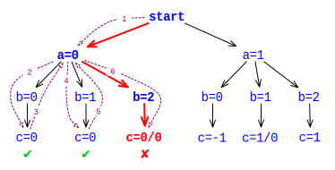

# Example: `java.util.Random` #

We start with a simple example that uses java.util.Random. Consider the following program that obtains two random values in (2) and (3), and then performs some computation (4) with them.

~~~~~~~~ {.java}
import java.util.Random;

public class Rand {
     public static void main (String[] args) {
          Random random = new Random(42);      // (1)
          
          int a = random.nextInt(2);           // (2)
          System.out.println("a=" + a);
          
          //... lots of code here
          
          int b = random.nextInt(3);           // (3)
          System.out.println("  b=" + b);
         
          int c = a/(b+a -2);                  // (4)
          System.out.println("    c=" + c);         
     }
}
~~~~~~~~

## Testing ##

Executing this program with a normal Java VM yields something like the following output. If we don't provide an explicit seed when creating the Random object in (1), the result is going to differ between runs, but every run will choose just a single `a` and `b` value (i.e. print just a single `"a=.."` and `"b=.."` line.

~~~~~~~~ {.java}
> java Rand
a=1
  b=0
    c=-1
> 
~~~~~~~~

Let's look at a graphical representation of all the ways our program could be executed, and how it actually was executed in our test run. The nodes of the graph represent *program states*, and the edges *transitions* the execution could take from a certain state.

{align=center width=700}

## Model Checking ##

Enter JPF - not much different results if we start JPF as a plain 'java' replacement. The only difference is that it (a) takes longer to complete, and (b) tells us something about a "search", which hints on that something more than in our test run is going on

~~~~~~~~ {.bash}
> bin/jpf Rand
JavaPathfinder v4.1 - (C) 1999-2007 RIACS/NASA Ames Research Center
====================================================== system under test
application: /Users/pcmehlitz/tmp/Rand.java

====================================================== search started: 5/23/07 11:48 PM
a=1
  b=0
    c=-1

====================================================== results
no errors detected

====================================================== search finished: 5/23/07 11:48 PM
>
~~~~~~~~

What is this "search" supposed to mean? Looking at source line (4) we realize that there is a potential problem: for certain `a` and `b` values, this expression can cause a division by zero `ArithmeticException`. Depending on the random seed used in (1), it's quite possible we would never encounter this case if we run (i.e. test) the program with a normal JVM.

Re-enter JPF - but this time we tell it to not only consider single values for `a` and `b`, but look at all possible choices:

~~~~~~~~ {.bash}
> bin/jpf +cg.enumerate_random=true Rand
JavaPathfinder v4.1 - (C) 1999-2007 RIACS/NASA Ames Research Center
====================================================== system under test
application: /Users/pcmehlitz/tmp/Rand.java

====================================================== search started: 5/23/07 11:49 PM
a=0
  b=0
    c=0
  b=1
    c=0
  b=2

====================================================== error #1
gov.nasa.jpf.jvm.NoUncaughtExceptionsProperty
java.lang.ArithmeticException: division by zero
        at Rand.main(Rand.java:15)
....
>
~~~~~~~~

What has happened? By specifying "+vm.enumerate_random=true" we told JPF to consider all possible values for expressions (2) and (3). JPF starts with `"a=0"`, then picks `"b=0"`, which yields a valid `"c=0"` value. But instead of terminating like a normal VM, JPF recognized that there are more choices left, so it backtracks to (3) and picks `"b=1"`. Again, no problem here with computing `"c=0"`. Back to (3), JPF now tries `"b=2"`, which of course spells disaster for our little program when executing (4), as can be seen by the following error report.

Here is a graphical representation of this search process. It should be noted that JPF per default only runs up to the point where it finds an error or there are no more choices left to explore. But if we would somehow fix the `"a=0,b=2"` case, JPF would still find the `"a=1,b=1"` case in the next run, since it systematically tries all choices. No matter what error it finds, JPF also keeps the complete trace (execution path) how it got to this error (denoted by the red arrows), which means we don't have to debug the program to find out.

{align=center width=450}
