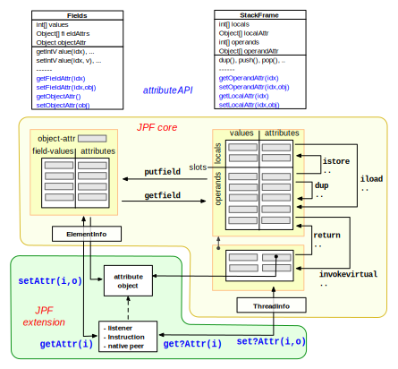

# The Attribute System #

While JPF stores values for operands, local variables and fields very similar to a normal VM, it also features a storage extension mechanism that lets you associate arbitrary objects with stack slots (operands and locals), fields, and whole objects (ElementInfos). The attribute objects can be set/used in [native peers](mji) or [listeners](listener) to add state stored/restored information that automatically follows the data flow.

Note that JPF does not restore attribute object values upon backtracking per default, only attribute references. If you need to make sure attribute values are restored, you have to use copy-on-write and then store back when accessing and modifying such attributes. 

{align=center width=650}

JPF provides an API to set/access these attributes, which is located in `gov.nasa.jpf.vm.Fields` (for field attributes) and `gov.nasa.jpf.vm.StackFrame` (for local variables and operands). Once set, the VM copies the attributes each time it reads/writes the associated field or stackframe slot. 

## Usage ##

For example, such attributes can be used to represent symbolic values or numeric error bounds. It should be noted though that attributes impose additional runtime costs, which is also why we don't treat normal, concrete values just as a special kind of attribute (normal values are still stored separately as builtin types like `int`). The upside of this is that your attributes coexist with normal, concrete values, which for instance allows things like mixed symbolic and concrete execution.

> **Note:** JPF now can associate attributes not only with fields of an object, but with the object as a whole. See the `gov.nasa.jpf.vm.ElementInfo` API for details.

> **Note:** while there is an API to set/retrieve attributes based on type, there is no implementation
yet that allows multiple attributes to be stored.