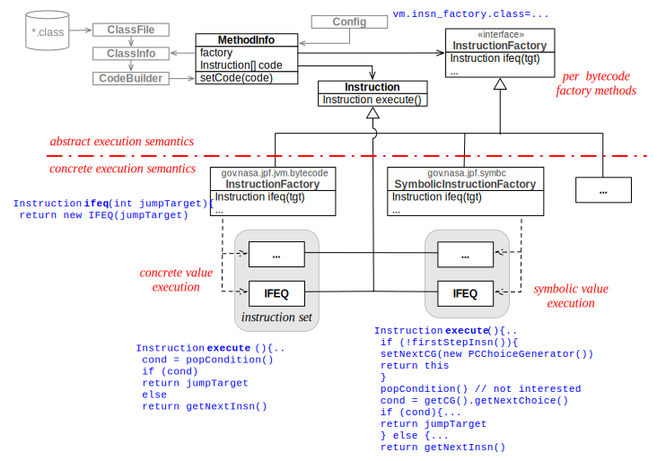

# Bytecode Factories #
Normally, a VM defines the semantics of it's programming language. In case of Java, the corresponding instruction set represents a multi-threaded stack machine, where values are kept on the heap, or inside of local and/or operand slots within stack frames. The effect of Java bytecode instructions with respect to heap, locals and operands are described in [Sun's Java virtual machine specifications](http://java.sun.com/docs/books/jvms/second_edition/html/VMSpecTOC.doc.html/).
JPF is different. The VM of JPF and its associated constructs like `ThreadInfo`, `ClassInfo`, `ElementInfo` etc. provide all the necessary means to implement a normal Java interpreter. However, JPF delegates the use of these means to the instructions. Every bytecode that gets executed by JPF is represented by a corresponding `Instruction` object, which normally gets instantiated during class load time. The `Instruction` classes of the standard execution mode can be found in package `gov.nasa.jpf.jvm.bytecode`.

When it comes to executing a bytecode, the VM simply calls the `execute()` method of this `Instruction` instance. The implementation of this method defines the execution semantics.

The trick is now that JPF uses a configurable [abstract factory](http://en.wikipedia.org/wiki/Abstract_factory_pattern) to choose and instantiate the `Instruction` classes. By providing your own concrete `InstructionFactory`, together with a set of related `Instruction` classes, you can change the execution semantics of Java.

{align=center width=850}

## Usages ##

Why would it be useful to change the standard semantics? One reason is to extend normal semantics with additional checks. For example, this is performed by the JPF extension jpf-numeric which overrides numeric bytecode classes with versions that check for over-/underflow and silent NaN propagation (among other things). A much more involved example is the JPF extension jpf-symbc, which implements a symbolic execution mode for Java, e.g. to automatically generate test cases based on the program structure of an application. It does so by overriding branch instructions, turning them into state space branches represented by their own [ChoiceGenerators](choicegenerator), collecting the path conditions on the way, and feeding them to an external SAT solver.

## Implementation ##

Since there is a large number of Java bytecode instructions, it would be tedious having to implement all 250+ Instruction classes in order to override just a couple of them. You can reduce the effort in three ways:

### GenericInstructionFactory ###

Using the `GenericInstructionFactory` as a base class for your `InstructionFactory`. This only requires you to specify an alternative package where your bytecode classes reside, together with the set of bytecodes that should be overridden. The resulting code can be quite short, as can be seen in the *numeric* extension example:

~~~~~~~~ {.java}
public class NumericInstructionFactory extends GenericInstructionFactory {
 
  // which bytecodes do we replace
  static final String[] BC_NAMES = {
    "DCMPG", "DCMPL",  "DADD", "DSUB", "DMUL", "DDIV",
    "FCMPG", "FCMPL",  "FADD", "FSUB", "FMUL", "FDIV",
                       "IADD", "ISUB", "IMUL", "IDIV",  "IINC", 
                       "LADD", "LSUB", "LMUL", "LDIV"   
  };
  
  // where do they reside
  protected static final String BC_PREFIX = "gov.nasa.jpf.numeric.bytecode.";
  
  // what classes should use them
  protected static final String[] DEFAULT_EXCLUDES = { "java.*", "javax.*" };
  
  public  NumericInstructionFactory (Config conf){    
    super(conf, BC_PREFIX, BC_NAMES, null, DEFAULT_EXCLUDES);
    
    NumericUtils.init(conf);
  }
}
~~~~~~~~

### Super Delegation ###

You can derive your overriding bytecode classes from the ones in `gov.nasa.jpf.jvm.bytecode`. If you just want to add some checks before or after performing the "normal" operation, you can use the standard `Instruction` classes as base classes, and call `super.execute(..)` from within your derived classes. 

### Attributes ###

As your execution semantics get more complex, you probably need to store and restore additional information that is associated with variables. JPF provides an automatically managed [attribute system](attributes) for this purpose. You can attach objects to locals, operands and fields, and JPF takes care of propagating these attribute objects whenever it manipulates stackframes or heap objects.

## Configuration ##

Configuring your bytecode factory just requires one JPF property, e.g.

~~~~~~~~ {.bash}
vm.insn_factory.class = gov.nasa.jpf.numeric.NumericInstructionFactory
~~~~~~~~

which can be either done from the command line or from within a *.jpf property file
