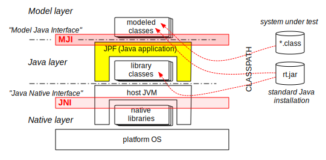
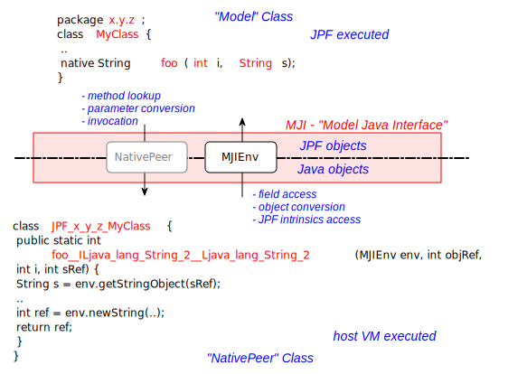
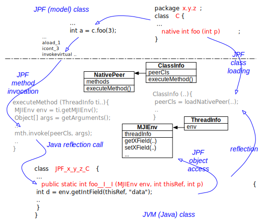
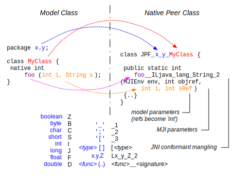
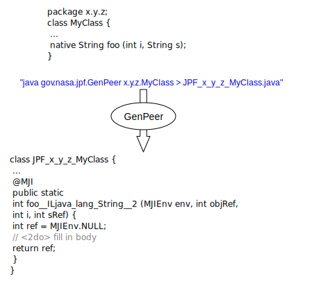

# Model Java Interface (MJI) #
## Purpose ##

Even if it is just a Java application (i.e. solely consists of Java classes), JPF can be viewed as a Java Virtual Machine (JVM) in itself. The consequence is that (*.class) class files, and even the same files at times, are processed in two different ways in a JVM running JPF

  * as ordinary Java classes managed and executed by the host JVM (standard Java library classes, JPF implementation classes)
  * as "modeled" classes managed and processed (verified) by JPF

Class lookup in both layers is based on the CLASSPATH environment variable / command line parameter, but this should not obfuscate the fact that we have to clearly distinguish between these two modes. In particular, JPF (i.e. the "Model" layer) has its own class and object model, which is completely different and incompatible to the (hidden) class and object models of the underlying host JVM executing JPF

{align=center width=560}

Each standard JVM supports a so called Java Native Interface (JNI), that is used to delegate execution from the Java level (i.e. JVM controlled bytecode) down into the (platform dependent) native layer (machine code). This is normally used to interface certain functionalities to the platform OS / architecture (e.g. I/O or graphics).

Interestingly enough, there exists a analogous need to lower the "execution" level in JPF, from JPF controlled bytecode into JVM controlled bytecode. According to this analogy, the JPF specific interface is called Model Java interface (MJI).

Even though MJI offers a wide range of applications, there are three major usages for delegating bytecode execution into the host JVM:

 1. Interception of native methods - without a abstraction lowering mechanism, JPF would be forced to completely ignore native methods, i.e. would fail on applications relying on the side effects of such methods, which is not acceptable (even if  many native methods indeed can be ignored if we restrict the set of verification targets)

 2. Interfacing of JPF system level functionality - some system level functions of standard library classes (esp. java.lang.Class, java.lang.Thread) have to be intercepted even if they are not native because they have to affect the JPF internal class, object and thread model (etc. loading classes, creating / starting threads). It should be noted that MJI can also be used to extend the functionality of JPF without changing its implementation.

3. State space reduction - by delegating bytecode execution into the non-state-tracked host JVM, we can cut off large parts of the state space, provided that we know the corresponding method side effects are not relevant for property verification (e.g. `System.out.println(..)`)

Besides these standard usages, there exist more exotic applications like collecting information about JPF state space exploration and making it available both to JPF and the verification target.

## MJI Components ##

The basic functionality of MJI consists of a mechanism to intercept method invocations, and delegate them by means of Java reflection calls to dedicated classes. There are two types of classes involved, residing at different layers:

  * Model Classes - these classes execute by the VM of JPF, which might be completely unknown to the host JVM
  * Native Peers - these classes, implemented by `NativePeer` subclasses, contain the implementations of the methods to intercept, and to execute by the host JVM

As part of the JPF implementation, MJI automatically takes care of determining which method invocations have to be intercepted by looking up the corresponding native peer methods

{align=center width=600}

This would not be very useful without being able to access the JPF object model (or other JPF intrinsics), from inside the native peer methods. Instead of requiring all native peers implementation to reside in a JPF internal package, there exists an interface class `MJIEnv` that provide access to the JPF internal structure in a controlled way. `NativePeer` classes  residing in `gov.nasa.jpf.vm` (i.e. the same package as `MJIEnv`) can reach all internal JPF features. Outside this package, the available API in `MJIEnv` is mostly restricted to the access JPF object (getting and setting values).

{align=center width=580}

Before a native peer method can be used, JPF has to establish the correspondence between the model class and the native peer. This takes place at load time of the model class. MJI uses a special name mangling scheme to lookup native peers, using the model class package name and class name to deduce the native peer class name.

{align=center width=560}

Since the model class package is encoded in the native peer name, the package of the native peer can be chosen freely. In analogy to JNI, native peers methods names include the signature of the model method by encoding its parameter types. If there is no potential ambiguity, i.e. mapping from native peer methods to model class methods is unique, signature encoding is not required.

Each native peer, which is an instance of a `NativePeer` subclass, is associated with exactly one `ClassInfo` instance.
All the native peer methods to be intercepted have to be `public` and annotated with `gov.nasa.jpf.annotation.MJI`. 
Moreover, MJI requires them to have two parameters: 

  * An instance of `MJIEnv` which can be used to access JPF internal constructs
  * An integer which is a handle for the corresponding JPF `this` object (or the `java.lang.Class` object in case of a static method) including the method to be intercepted

See [Mangling for MJI](mji/mangling) for more details and examples of mangling.

Going beyond the JNI analogy, MJI can also be used to intercept

  * non-native methods (i.e. the lookup process is driven by the methods found in the native peer, not the `native` attributes in the model class. This can be particularly useful in case the class is used from both as a model class and a JVM class (e.g. `gov.nasa.jpf.vm.Verify`), using a method body that directly refers to the native peer
  * class initialization (the corresponding native peer method has to be named `$clinit(MJIEnv env, int clsRef)`)
  * constructors (the corresponding native peer method has to be named `$init__<sig>(MJIEnv env,int objRef, <ctor-params>)` and the normal signature mangling rules apply)

It is important to note that type correspondence does NOT include references. All references (object types) on the JPF side are transformed in handles (int values) on the JVM side. The passed in `MJIEnv` parameter has to be used to convert/analyze the JPF object. Since MJI per default uses the standard Java reflection call mechanism, there is a significant speed penalty (lookup, parameter conversion etc.), which again is a analogy to JNI.

Even if it is not directly related to MJI, it should be mentioned that some JPF specific model classes cannot be loaded via the CLASSPATH (e.g. `java.lang.Class`), since they contain JPF based code that is not compatible with the host JVM (e.g. relying on native methods that refer to JPF functionality). Such classes should be kept in separate directories / jars that are specified with the JPF command line option `-jpf-bootclasspath` or `-jpf-classpath`. This is mostly the case for system classes. On the other hand, model classes don't have to be JPF specific. It is perfectly fine to provide a native peer for a standard Java class (e.g. `java.lang.Character`), if only certain methods from that standard class needs to be intercepted. Native peers can contain any number of non-"native" methods and fields, but those should not be annotated with `@MJI` to avoid lookup problems.

## Tools ##

To ease the tedious process of manually mangle method names, MJI includes a tool to automatically create skeletons of native peers from a given Model class, called `GenPeer`. The translation process uses Java reflection, i.e. the model class needs to be in the CLASSPATH and is specified in normal dot notation (i.e. not as a file).

{align=center width=470}

There exist a number of command line options that can be displayed by calling `GenPeer` without arguments. `GenPeer` per default writes to stdout, i.e. the output has to be redirected into a file.

Since method invocation by reflection used to be a slow operation, we previously also had a tool called `GenPeerDispatcher`, which used method signature hash-codes to explicitly dispatch native peer methods. With recent improvements in JVM performance, this tool became obsolete.

## Example ##

The following example is an excerpt of a JPF regression test, showing how to intercept various different method types, and using `MJIEnv` to access JPF objects.

### Model class (JPF side) ###

This is executed by JPF, which means it needs to be in JPF's  `vm.classpath` setting. 

~~~~~~~~ {.java}
public class TestNativePeer {
    static int sdata;
    
    static {
      // only here to be intercepted
    }
    
    int idata;
    
    TestNativePeer (int data) {
      // only here to be intercepted

    }
  
    public void testClInit () {
      if (sdata != 42) {
        throw new RuntimeException("native 'clinit' failed");
      }
    }

    public void testInit () {
      TestNativePeer t = new TestNativePeer(42);

      if (t.idata != 42) {
        throw new RuntimeException("native 'init' failed");
      }
    }

    native int nativeInstanceMethod (double d, char c, boolean b, int i);

    public void testNativeInstanceMethod () {

      int res = nativeInstanceMethod(2.0, '?', true, 40);
      if (res != 42) {
        throw new RuntimeException("native instance method failed");
      }
    }
    
    native long nativeStaticMethod (long l, String s);

    public void testNativeStaticMethod () {
      long res =  nativeStaticMethod(40, "Blah");

      if (res != 42) {
        throw new RuntimeException("native instance method failed");

      }
    }
    
    native void nativeException ();
    
    public void testNativeException () {
      try {
        nativeException();
      } catch (UnsupportedOperationException ux) {
        String details = ux.getMessage();

        if ("caught me".equals(details)) {
          return;
        } else {
          throw new RuntimeException("wrong native exception details: " +
                                     details);
        }
      } catch (Throwable t) {
        throw new RuntimeException("wrong native exception type: " +
                                   t.getClass());
      }

      throw new RuntimeException("no native exception thrown");
    }
  }
~~~~~~~~

### Native Peer class (host VM side) ###

This is executed by the host VM (i.e. at the same level like JPF itself), so make sure it is in your CLASSPATH.

~~~~~~~~ {.java}
public class JPF_gov_nasa_jpf_vm_TestNativePeer {

    @MJI
    public static void $clinit (MJIEnv env, int rcls) {
      env.setStaticIntField(rcls, "sdata", 42);
    }

    @MJI
    public static void $init__I (MJIEnv env, int robj, int i) {
      env.setIntField(robj, "idata", i);
    }

    // preferably use full signature mangling
    @MJI
    public static int nativeInstanceMethod__DCZI__I (MJIEnv env, int robj,
                                            double d, char c,
                                            boolean b, int i) {
      if ((d ## 2.0) && (c  ## '?') && b) {
        return i + 2;
      }
      return 0;
    }

    //..but it also works without, if there is no overloading (don't be lazy!) 
    @MJI
    public static long nativeStaticMethod (MJIEnv env, int rcls,
                                           long l, int stringRef) {
      String s = env.getStringObject(stringRef);
      if ("Blah".equals(s)) {
        return l + 2;
      }
      return 0;
    }

    @MJI
    public static void nativeException____V (MJIEnv env, int robj) {
      env.throwException("java.lang.UnsupportedOperationException",
                         "caught me");
    }
  }
~~~~~~~~

