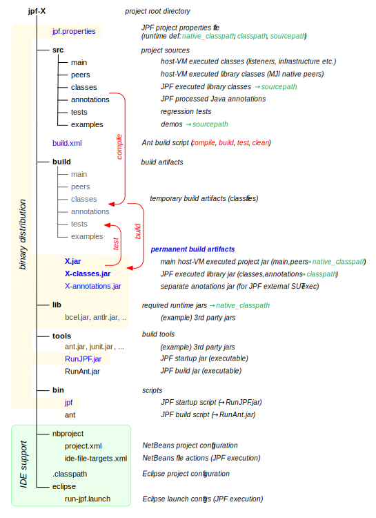

# JPF Runtime Modules #

JPF is partitioned into separate projects that all follow the same directory layout and build process. Modules can be distributed as source or binary distributions. Binary distributions are just slices through the directory tree of a source distribution that preserve the permanent build artifact, i.e. both distribution forms are runtime-compatible.

{align=center width=750}
 
The main artifacts are the *.jar files created and stored in the `build` directory. We can divide this into classes that are executed by the host VM (i.e. have to be in JPF's `native_classpath` setting), and classes that are executed by JPF itself (i.e. have to be in JPF's `classpath` setting). The first category includes [listeners](listener) and [native peers](mji), the second one model classes (compiled from `src/classes`) and annotations, i.e. the system under test code.

The build process is [Ant](http://ant.apache.org/) based, which means every source distribution comes with a build.xml script that implements the basic build targets `clean`, `compile`, `build` and `test`.

We do not include required 3rd party runtime and build libraries in the project distributions.
The `compile` Ant target uses the standard `javac` command which requires a full JDK installation. `test` generally executes a JUnit based regression test suite. Both JUnit and Ant libraries are also need to be installed.

<included in the jpf-core distribution, which also contains the minimal RunAnt.jar executable jar which can be distributed with other JPF projects to use the jpf-core provided 3rd party build tools.>

<The `lib` directory contains 3rd party libraries that are required at runtime of the project (like bcel.jar in jpf-core).>

<tools contains programs and libraries that are used by the build process (like ant.jar and junit.jar in jpf-core).>

For convenience reasons, JPF modules come with corresponding NetBeans and Eclipse configurations, i.e. can be directly opened as projects within these IDEs.

