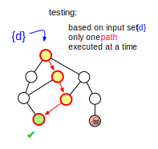
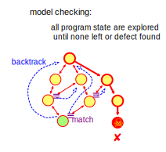
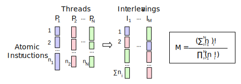

# Testing vs. Model Checking #

So what JPF does is test our program for defects? No, it usually does more, at least when used as a model checker. How does testing differ from model checking?

Software testing is an empirical set of techniques where you execute your program with a number of inputs in order to find out if it behaves correctly. This comes with two parts that involve the right choices: test input and test oracle.

{align=center}

Testing techniques differ on how we choose the input (random, "interesting" problem domain values like corner cases etc.), and on how much knowledge about the SUT and its execution environment we assume (black/grey/white box), which especially affects how we can define and check correct behavior. This involves a lot of educated guesses, or as Edsger Dijkstra has put it: "program testing can at best show the presence of errors but never their absence". We usually compensate this by performing "enough" tests - which would be the next guess. Testing complex systems can easily turn into finding a needle in a haystack. If you are a good tester, you make the right guesses and hit the defect that is inevitably there. If not, don't worry - your users will find it later.

{align=center}

[Model Checking](http://en.wikipedia.org/wiki/Model_checking) as a [Formal Method](http://en.wikipedia.org/wiki/Formal_methods) does not depend on guesses. At least as the theory goes, if there is a violation of a given specification, model checking will find it. Model checking is supposed to be a rigorous method that exhaustively explores all possible SUT behaviors. 

To illustrate this, look at the [Random value example](random_example), which shows how testing differs from model checking if we have a program that uses a sequence of random values: the test always processes just one set of values at a time, and we have little control over which ones. Model checking doesn't stop until it has checked all data combinations or has found an error.

With the random example, we can at least see the choices in our program. Consider a concurrent program, such as [Data race example](race_example) - do you know where the operating system switches between threads? All we know is that different scheduling sequences can lead to different program behavior (e.g. if there are data races), but there is little we can do in our tests to force scheduling variation. There are program/test spec combinations which are "untestable". Being a virtual machine, our software model checker doesn't suffer the same fate - it has complete control over all threads of our program, and can execute all scheduling combinations.

{align=center width=550}

That is the theory. In reality "all possible" can be a pretty large number - too large for existing computing resources or our patience. Just assume the number of different scheduling sequences of a program consisting of N threads P,,1,, .. P,,N,, that each have n,,i,, atomic instruction sequences.

For 2 threads with 2 atomic sections each this gives us 6 different scheduling combinations. For 8 sections the result is 12870, 16 sections yield 601080390 - that is why it is called *state explosion*. Software model checking has a scalability problem, even more so than model checking of hardware, since programs usually have a lot more states.

There are several things we can do. First, we can optimize the model checker, which is simply an engineering feat. Next, we can find program states which are equivalent with respect to the properties we are checking, which can be done with various degrees of abstractions and value representations. Last, we can try to get to the defect first, before we run out of time or memory. But this is where the boundary between testing and model checking becomes blurred, as it involves things like heuristics about interesting input values or system behaviors, and these heuristics tend to drop reachable program states.

JPF does all of the above to curb the state space explosion, and most things are configured instead of hardwired, so you don't depend on built-in heuristics. But no matter how much we shrink the state space, JPF can still observe a lot more about the program execution than normal tests (i.e. we can be more precise with our oracles), and it still knows about the execution history in case we find a defect, which is always just the first part - we also need to understand it so that it can be fixed eventually. 

