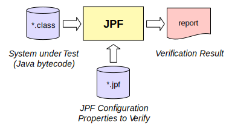

# What is JPF? #

That depends on how you configure it. 
First and foremost, there is no single, monolithic JPF - it is a runtime configured combination of different components. The project *jpf-core* is the essential component that constitutes the core structure of JPF. 
Here we explain what *jpf-core* is.
<!--- JPF is designed in a way which can be easily extended.
We therefore restrict ourselves here to what the *jpf core* is, but keep in mind it is only primus inter pares among JPF components. --->

## The Core : a VM that supports Model Checking ##

{align=center width=400}

The JPF core is a Virtual Machine (VM) for Java™ bytecode. That means that JPF is a program which executes the system under test (SUT). The VM of JPF is able to handle bytecode instructions that are created by a standard Java compiler. While execution semantics of Java bytecodes are clearly defined in [Sun's Java virtual machine specifications](http://java.sun.com/docs/books/jvms/second_edition/html/VMSpecTOC.doc.html/), we have little hardwired semantics in JPF - the VM instruction set is represented by a set of classes that can be replaced. 
JPF is a special VM. JPF itself is written in Java, so it is not as fast as your normal Java. That implies  that JPF is VM which is running on top of another VM. 

As JPF executes the SUT, it checks for certain properties which are given to JPF as input. Some of the properties that can be checked by JPF are unhandled exceptions, deadlocks, and user-defined assertions which are used to test properties of the code's behavior.
JPF gets back to you with a report that says if the properties hold and/or which verification artifacts have been created by JPF for further analysis (like test cases). 

JPF (theoretically) explores *all* potential executions in a systematic way. In contrast, an ordinary JVM executes the code in only one possible way.
Basically, JPF can identify points, which represent *execution choices*, in your program from which the execution could proceed differently. Then it systematically explores all of them.
Typical execution choices are different scheduling sequences or random values, but JPF allows you to introduce your own type of choices such as user input or state machine events.

The number of paths can grow out of hand, and it usually will. This is known as the most challenging problem in software model checking referred to as *state space explosion problem*. 
JPF uses different ways to mitigate this problem. The first line of defense employed by JPF is *state matching*: each time JPF reaches a choice point, it checks if it has already seen a similar program state, in which case it can safely abandon this path, *backtrack* to a previous choice point that has still unexplored choices, and proceed from there. That's right, JPF can restore program states, which is like telling a debugger "go back 100 instructions".

So what are these features used for? Normally to find defects in the SUT, but what kind of defects? By now you know the answer: it depends on how you configure JPF. By default, the core checks for properties that can be identified by the VM without you having to specify them: deadlocks and unhandled exceptions (which also covers Java `assert` expressions). We call these *non-functional* properties, and no application should violate them. But JPF doesn't stop there - you can define your own properties, which is mostly done with so called *listeners*, little "plugins" that let you closely monitor all actions taken by JPF, like executing single instructions, creating objects, reaching a new program state and many more. An example of a property implemented in the form of a listener is a race detector, which identifies unsynchronized access to shared variables in concurrent programs (the JPF core comes with two of them).

One additional feature that comes in handy in case JPF finds a defect is the complete execution history that leads to the defect, including every executed bytecode instruction. We call this a program *trace*, and it is invaluable to find out what really caused the defect. Think of a deadlock - usually there is not much you can directly deduce from a snapshot of call stacks.

All this explains why JPF is called "a debugger toolbox on steroids": first it automatically executes your program in all possible ways to find defects you don't even know about yet, then it explains you what caused these defects.

## Caveat : not a lightweight tool ##

Of course that is the ideal world. In reality, this can require quite a lot of configuration and even some programming. JPF is not a "black box" tool like a compiler, and the learning curve can be steep. What makes this worse is that JPF cannot execute *native code* which is implemented in a language other than Java but invoked from Java applications. 
Not because it doesn't know how to do that, but because it often doesn't make sense: native code like system calls to write to a file cannot easily be reverted - JPF would loose its capability to match or backtrack program states. But of course there is a remedy, and it is configurable: *native peers* and *model classes*. Native peers are classes that hold methods that are executed in lieu of real native methods. This code is executed by the real Java VM, not JPF, hence it can also speed up things. Model classes are simple replacements of standard classes, like `java.lang.Thread` that provide alternatives for native methods which are fully observable and backtrackable.

If you are familiar with Java implementations, you know about the humongous proportions of the included libraries, and hence it is obvious that we cannot handle all of them, at least not yet. There is no theoretical limit, and implementing missing library methods is usually pretty easy, but you should be prepared to encounter `UnsatisfiedLinkErrors` and such if you let JPF loose on large production systems. Notorious white spots are `java.io` and `java.net`, but there are people working on it. Who knows, maybe you are interested to join the effort - JPF is open sourced and there is nothing you can't see. We now have more than two dozen major collaborators in industry, government and academia around the world.

So what makes it worthwhile to invest in JPF? After all, it is a heavyweight tool, not a quick and simple bug finder. First, if you are looking for a research platform to try out your new software verification ideas, chances are you can get along with JPF in a fraction of time compared to native production VMs, which are typically optimized towards speed and care little about extensibility or observability.

The second answer is that - as of this writing - there are bugs *only* JPF can find (before the fact, that is), and there are more and more Java applications that cannot afford to learn about these bugs after the fact. JPF is a tool for mission critical applications, where failure is not an option. No surprise it was started by NASA.

