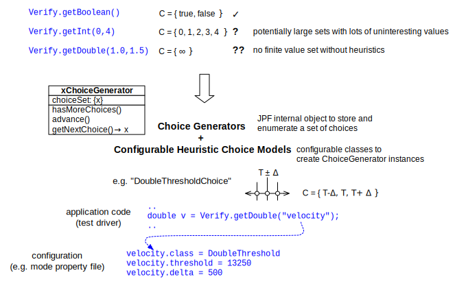

# The Verify API #
Although the primary purpose of JPF is to verify applications that are not JPF dependent, it can also be used to check programs that are explicitly written to execute under JPF. There are two ways to do this

 * use of jpf annotations such as `@gov.nasa.jpf.annotation.JPFConfig` and `@gov.nasa.jpf.annotation.FilterField`
 * use of the various `gov.nasa.jpf.vm.Verify` APIs

The first method provides only directives to JPF (by means of Java annotations), and does not modify or add any specific code to your system under test. The second one is imperative and should only be used by JPF specific test drivers.

## JPF Annotations ##
The JPF core currently supports two annotation types: `@JPFConfig` and `@FilterField`

~~~~~~~~ {.java}
import gov.nasa.jpf.annotation.JPFConfig
...
@JPFConfig({"listener+=,gov.nasa.jpf.aprop.listener.SharedChecker", ..})
public class MyClass {
  ..
}
~~~~~~~~

The `@JPFConfig` annotation allows to set JPF properties (<key>=<value> pairs) for classes and methods of your application, which is especially useful to add specific listeners. You have to be aware of the property effects though, since not all behavior can be changed at runtime, and you usually cannot reverse features with this method

The `@FilterField` annotation is used to mark certain fields in your application as not relevant for state matching. This is useful if you have to add debugging information like counters that would otherwise increase the state space (i.e. would prevent state matching).

~~~~~~~~ {.java}
import gov.nasa.jpf.annotation.FilterField;
...
public class MyClass {
  ..
  @FilterField int counter;
  ..
}
~~~~~~~~

This does not change execution of your program in any way, and also does not affect backtracking within JPF (i.e. values are properly restored). It only tells JPF to ignore marked fields when hashing/matching program states.

There is a [jpf-aprop](wiki:projects/jpf-aprop) JPF module that is dedicated to Java annotation based program properties such as `@Nonnull`, `@NonShared`, `@Immutable`, `@Requires` and many others.

## The Verify API ##

Sometimes it is useful to create JPF specific test drivers, like you create JUnit test cases. In this code, you can make explicit use of JPF APIs, since it is not supposed to run outside JPF. There are several categories of APIs which are encapsulated in the `gov.nasa.jpf.vm.Verify` class.

### Data ChoiceGenerators ###
Data ChoiceGenerators (CGs) are suitable for writing test drivers that are JPF aware. The idea is to obtain non-deterministic input values from JPF in a way that it can systematically analyze all relevant choices. In its most simple form, this can be used like

~~~~~~~~ {.java}
// test driver code
import gov.nasa.jpf.vm.Verify;
..
boolean cond = Verify.getBoolean();
// following code is executed for both cond=true AND cond=false
..
~~~~~~~~

The `Verify` class contains methods for creating a number of different choice generators for builtin Java types, like

~~~~~~~~ {.java}
..
int i = Verify.getInt(min,max); // evaluates for all values between 'min' and 'max' (inclusive)
..
double d = Verify.getDoubleFromSet(-42.0, 0.0, 42.0 ..); // evaluates all given values
..
~~~~~~~~ 

CGs don't stop at value sets that can be completely enumerated based on their type (like boolean, and - at least theoretically - integers). JPF also supports configured heuristics based choice generators, where the values sets are application dependent and can be specified in property files.

{align=center width=750}

Choice generator implementation is described in a [separate section](wiki:devel/choicegenerator) of this documentation.

### Search Pruning ###

Explicitly restricting the search is useful for highly application specific properties, where it is obvious that certain values are not of interest with respect to the property.

~~~~~~~~ {.java}
// ..compute some data..
Verify.ignoreIf(data > someValue); // prune search if true
// ..do some stuff with data..
~~~~~~~~
If the provided expression evaluates to true, JPF does not continue to execute the current path, and backtracks to the previous non-deterministic choice point.

### State Annotation ###
Based on certain value combinations, an application might give JPF hints about the relevance of a program state that can be subsequently used by Search and/or Heuristic implementations.

~~~~~~~~ {.java}
// ..compute some data
Verify.interesting( data < someValue );
// ..do some stuff with data
~~~~~~~~

This does not stop execution by JPF, but stores an 'interesting' attribute for the current state. Its more general version is used to attach arbitrary strings to states:

~~~~~~~~ {.java}
// ..compute some data
if (data < someValue) {
  Verify.setAnnotation("critical data value");
  // ..do some stuff with dat
~~~~~~~~

Again, this category is about to become less important since Search- and VMListeners are superior mechanisms to store not just strings but arbitrary objects as state annotations.

### Verification Output ###

This is the most simple category, which is used to differentiate between normal program output (that is executed and analyzed by JPF), and output that is strictly verification relevant, i.e. should not appear when executing a program outside JPF. Not very surprising, it contains a number of print(..) methods.

### Atomicity Control ###

this category can be used to control the number of thread interleavings JPF has to analyze. While this is problematic in terms of missing potential defects, it is was often the only way to constrain the state space so that JPF could verify a given application.

~~~~~~~~ {.java}
Verify.beginAtomic();
...
// all code in here is executed by JPF in one transition
...
Verify.endAtomic();
~~~~~~~~

Direct atomicity control was mainly used before the automatic, on-the-fly partial order reduction (POR) was implemented, and only remains relevant for applications that are (still) problematic with respect to POR. JPF's on-the-fly POR implementation is described in a [separate section](../devel/partial_order_reduction) of this documentation.

### Other Usages ###

Some `Verify` methods support collecting information during JPF execution, which is persistent and can be later-on queried by JPF embedding code (programs that execute JPF). This uses an MJI trick where the [native peer](../devel/mji) class (`JPF_gov_nasa_jpf_vm_Verify`) is used to set some data during JPF execution, which can be later-on retrieved by model class code (through `gov.nasa.jpf.vm.Verify`) that is executed outside of JPF. This is currently used to implement counters, which in turn are used to verify JPF itself.

It should be noted that while most of the Verify APIs have alternative implementations that enable execution outside of JPF, applications using them at least don't build outside the JPF environment. Their use therefore is only recommended for JPF specific test drivers.