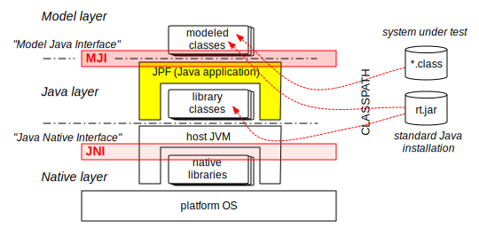
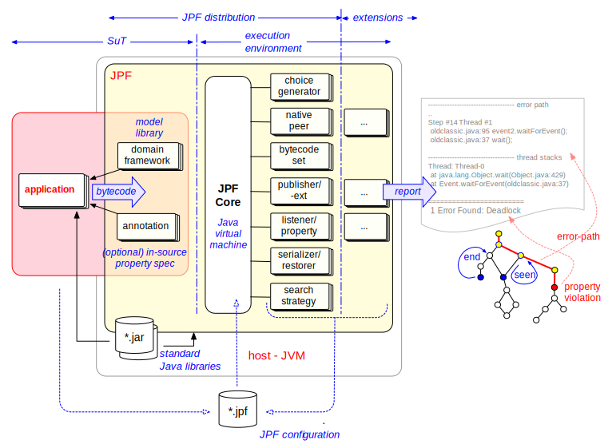

# JPF components #
Java is more than a programming language. It is a set of layers that starts with a platform specific VM implementation (which is referred to as the *host VM*) that sits on top of native libraries written for and using your operating system. To this stack, we add JPF - a Java application that runs on top of the "host VM", but is itself a VM which then executes your System Under Test (SUT).

{align=center width=700}

With all this recursion, it is easy to get confused about what Java code gets processed at which level. To make things worse,  most of the standard library class files (java.* classes) and some of the annotations get processed by both VMs, but of course in different instantiations. Purpose of this page is to shed some light on what code is associated with the different layers and parts of the system.

In order to untangle, we have to step back and look at what components are involved when applying JPF to the SUT. We categorize the components with respect to two aspects:

 1. processing VM (host VM, JPF)
 1. associated distribution entity (host Java installation, JPF core, JPF extensions, SUT)

Remember the [What is JPF](../intro/what_is_jpf) diagram from the introduction? This is a more detailed version of it. 

{align=center width=800}

Let us walk this diagram left-to-right. We start with the compiled Java application we want to verify. This is of course not part of the JPF distribution, but will be executed by JPF, so the corresponding class files do not have to be visible to the host VM (that runs JPF). However, the application code might use classes and interfaces that reside in the JPF distribution. Together, the application and such modeling libraries and/or annotations form the System under Test (SUT)

Next comes the JPF core itself. By now we know this is mainly a VM that is written in Java itself, so you run it on whatever Java system is installed on your machine. This means all classes that constitute JPF need to be visible to the host JVM, e.g. by setting the global `CLASSPATH` environment variable (which is not the recommended way to do this). 

Now comes the important part: **JPF is not a monolithic system**. It uses various configured components to do things such as

 * property implementation
 * library modeling
 * report generation

and much more. Even if you don't specify anything when you run it, JPF will use a default configuration that pulls in a lot of components such as [listeners](../devel/listener), which do not have to be part of the [JPF core](../jpf-core/index), but can reside in their own JPF extension modules.

If you do specify your own [configuration](../user/config), you can tell JPF to use components that live outside of the [JPF core](../jpf-core/index) distribution, either in one of the installed JPF extension modules, or in your own project. Either way, all these [listeners](../devel/listener), [native peers](../devel/mji), [publishers](../devel/report) and other components are at runtime part of the whole  JPF system, so they need to be visible to the host VM.

The last part is the most tricky one - your application is most probably using standard Java libraries (e.g. `System.out.println()`), as do the classes that constitute JPF. Some of the standard library classes have to be replaced by JPF specific versions when JPF executes the SUT (e.g. classes such as `java.lang.Class`that have native methods), and JPF has a special [MJI](../devel/mji) mechanism to do that. However, most standard library classes have pure Java implementations, and we take these straight from the host-JVM installation. This means, standard libraries end up in JPF's classpath *and* the host JVM CLASSPATH: and their code is executed by JPF *and* the host VM, but the corresponding instances are different (for instance, a `java.lang.String` object has very different representations in the host VM and JPF).

JPF keeps associated class paths separate. There are three different path settings in the JPF configuration:

 1. `native_classpath` - this includes everything that has to be visible to the host VM, which includes mostly the classes of JPF itself, listeners, native peers and bytecode instruction sets. The `native_classpath` is dynamically constructed from your site.properties and jpf.properties [configuration files](../user/config) during JPF startup, and processed by the JPF classloader
 2. `classpath` - this includes the classes that are executed by JPF, which include your SUT, and all libraries that are used by it (*-classes.jar of installed JPF components). Note that some of the library classes (like `java.lang.Thread`) are replaced by JPF specific versions. Again, this is constructed by JPF during startup from all your configured jpf.properties files, but processed by JPFs internal classfile lookup mechanism.
 3. `sourcepath`  - depending on the reports that have to be generated by JPF, it might have to find SUT and library sources for the executed classfiles (bytecodes). This is how you tell JPF where these sources reside.

You can set these path lists explicitly from your application property file or the command line, but it is better to let JPF collect them when processing the jpf.properties files of your installed JPF components, which all include  lines like

~~~~~~~~ {/bash}
<jpf-module>.native_classpath = ..
<jpf-module>.classpath = ..
<jpf-module>.sourcepath = ..
~~~~~~~~

A word of caution: if - during JPF startup - you encounter a message like

~~~~~~~~ {.bash}
...
[SEVERE} error during VM runtime initialization: wrong model classes (check 'classpath')
~~~~~~~~

it means the `classpath` setting is wrong and JPF loads some of the standard library classes that have to be replaced with its own versions  - they need to be *modeled* (like `java.lang.Thread`, `java.lang.Class` and others - all part of jpf-classes.jar within the jpf-core module).

This can also happen later-on with less essential library classes that are not part of jpf-core, but should be loaded from one of the installed extensions. In this case, this usually shows up as an `UnsatisfiedLinkError`
