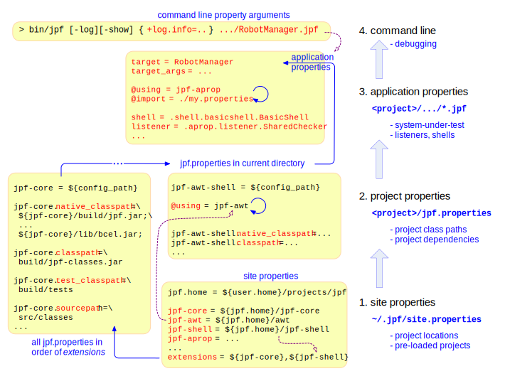

# Configuring JPF #

JPF configuration can be intimidating. It is worth to think about why we need such a heavy mechanism before we dive into its details. Little in JPF is hardwired. Since JPF is such an open system that can be parameterized and extended in a variety of ways, there is a strong need for a general, uniform configuration mechanism. The challenge for this mechanism is that many of the parts which are subject to parameterization are configured themselves (i.e. options for optional JPF components like listeners). This effectively prohibits the use of a configuration object that contains concrete fields to hold configuration data, since this class would be a central "design bottleneck" for a potentially open number of JPF components like Searches, Instruction sets and Listeners.

The goal is to have a configuration object that

  * is based on string values
  * can be extended at will
  * is passed down in a hierarchical initialization process so that every component extracts only its own parameters

We achieve this by means of a central dictionary object (`gov.nasa.jpf.Config`) which is initialized through a hierarchical set of Java property files that target three different initialization layers:

  1. site: optionally installed JPF components
  2. project: settings for each installed JPF module and (optionally) systems under test
  3. application: the class and program properties JPF should check (this is part of your system under test)

Initialization happens in a prioritized order, which means you can override anything from later configuration stages, all the way up to command line parameters. Actually, this can be even overridden by using the `Verify` API from system under test code, but this is a developer topic. Here is the blueprint, which we will examine in order of execution:

{align=center width=800}

## Property Types ##

Property specifications are processed in a hierarchical order: site properties, project properties, application properties and command line properties. Later stages can override previous stages. Each property is a `<key>=<value>` pair, but we do support some special notations (see below) for key/value expansion, value extension, and pseudo properties that act as directives.

### Site Properties ###
The site.properties file is machine specific and not part of any JPF project, which means you have to create a [ site.properties](wiki:install/site-properties) file as part of the install process. A sample site.properties might look like:

~~~~~~~~
jpf-core = ${user.home}/projects/jpf/jpf-core
jpf-shell = ${user.home}/projects/jpf/jpf-shell
jpf-awt = ${user.home}/projects/jpf/jpf-awt
...
extensions=${jpf-core},${jpf-shell}
~~~~~~~~

Each module is listed as a `<name>=<directory>` pair, and optionally added to the comma separated list of `extensions`. The order in which modules are added to `extensions` does matter, since it will determine the order in which each of these components is initialized, which basically maps to an ordered list of classpath entries (both for the host VM and JPF itself - paths are kept separate).

Note that we do **not** require all modules being added to `extensions`, **but** jpf-core needs to be in there. Dependencies on modules not listed in `extensions` can be specified later-on with the `@using` directive. It is a good idea to keep the `extensions` list small to avoid conflicts, and to improve class load times (shorter classpaths). 

Note also that the `extensions` entries are of the form `${<key>}`, which tells JPF to replace these expressions with the value that is associated to <key>. 

Site properties have to be stored in the directory from where you start JPF, one of its parent directories, or a global `${user.home}/.jpf/site.properties`. We recommend a to keep it in a common root directory that contains all your JPF projects and modules.

### Project Properties ###
Each JPF module contains a jpf.properties file in its root directory, no matter if this is the jpf-core or an extension. System under test projects can contain a jpf.properties file to factor out common settings (such as class paths) for all JPF applications within this project.

A project property file defines the JPF specific paths that need to be set for the module or system under test to work properly

 1. `<module-name>.`**`native_classpath`**: the host VM classpath (i.e. the classes that constitute JPF itself)
 1. `<module-name>.`**`classpath`**: the classpath JPF uses to execute the system under test
 1. `<module-name>.`**`test_classpath`**: host VM and JPF classpath for regression tests
 1. `<module-name>.`**`sourcepath`**: the path entries JPF uses to locate sources in case it needs to create program traces

Additionally, `jpf.properties` should contain default values for all module or project specific settings (e.g. report options).

An example project properties file might look like:

~~~~~~~~ {.bash}
jpf-aprop = ${config_path}

#--- path specifications
jpf-aprop.native_classpath = build/jpf-aprop.jar;lib/antlr-runtime-3.1.3.jar
jpf-aprop.classpath = build/examples
jpf-aprop.test_classpath = build/tests
jpf-aprop.sourcepath = src/examples

#--- other project specific settings
listener.autoload=${listener.autoload},javax.annotation.Nonnull,...
listener.javax.annotation.Nonnull=gov.nasa.jpf.aprop.listener.NonnullChecker
...
~~~~~~~~

The first entry (`<module-name>=${config_path}`) in a jpf.properties should always define the module name. JPF automatically expands `${config_path}` with the pathname of the directory in which this jpf.properties file resides.

jpf.properties are executed in order of definition within site.properties, with one caveat: if you start JPF from within a directory  that contains a jpf.properties file, this one will always take precedence, i.e. will be loaded last (overriding previous settings except of the command line). This way, we ensure that JPF developers can enforce priority of the component they are working on.

Both site.properties and jpf.properties can define or override any key/value pairs they want, but keep in mind that you might end up with different system behavior depending on where you start JPF - avoid configuration force fights by keeping jpf.properties settings disjunct wherever you can.

Please note that site and project properties have to be consistent, i.e. the module names (e.g. jpf-awt) in site.properties and jpf.properties need to be the same. This is also true for the build.xml Ant project names.

It is perfectly fine to have a jpf.properties in a SUT that only uses JPF for verification. You need at least to set up the `classpath` so that JPF knows where to find the SUT classes.

### Application Properties ###
In order to run JPF, you need to tell it what main class it should start to execute. This is the minimal purpose of the *.jpf application properties files, which are part of your systems under test (SUT). Besides the `target` setting that defines the main class of your SUT, you can also define a list of `target_args` and any number of JPF properties that define how you want your application to be checked (listeners, search policy, bytecode factories etc.). A typical example looks like

~~~~~~~~ {.bash}
#--- dependencies on other JPF modules
@using = jpf-awt
@using = jpf-shell

#--- what JPF should run
target = RobotManager

#--- other stuff that defines how to run JPF
listener+=,.listener.OverlappingMethodAnalyzer

shell=.shell.basicshell.BasicShell
awt.script=${config_path}/RobotManager-thread.es
cg.enumerate_random=true
...
~~~~~~~~

The `@using = <module-name>` directive tells JPF to load the `jpf.properties` of the specified projects (defined in `site.properties`). This is the way to ensure proper path initialization of projects that are not listed in `extensions`. 

### Command Line Properties ###
Last not least, you can override or extend any of the previous settings by providing "**+**<key>=<value>" pairs as command line options. This is convenient for experiments if you have to determine the right settings values empirically

## Special Property Syntax ##
JPF supports a number of special notations that are valid Java properties syntax, but are only processed by JPF (and - to a certain extend - by Ant):

 * **`key=...${x}..`** - replaces `"${x}"` with whatever is currently stored under the key "`x`". This also works recursively, as in "`classpath = mypath;${classpath}`". Note that while Apache Ant does also support value expansion, but not recursively. In addition, JPF also supports expansion in the key part (i.e. left of the "`=`")

 * **`key+=val`** - appends val to whatever is currently stored under "`key`". Note that there can be no blank between key and "`+=`", which would not be parsed by Java. This expansion only works in JPF 

 * **`+key=val`** - in a properties file adds "`val`" in front of what is currently stored under "`key`". Note that if you want to use this from the command line, you have to use two "`++`", since command line options start with "+"

 * **`${config_path}`** - is automatically set to the directory pathname of the currently parsed property file. This can be useful to specify relative pathnames (e.g. input scripts for the jpf-awt extension)

 * **`${config}`** - is set to the file pathname of the currently parsed file

 * **`@requires=<key>`** - can be used to short-circuit loading of a properties file. This is a simple mechanism to control loading of jpf.properties file sections that are incompatible with other modules, and compares to `#ifdef` preprocessor directives. The respective keys are usually set from application properties (*.jpf) files. 
Note this does not throw an exception if the required key is not defined, it just bails out of loading the properties file that contains the @requires directive

 * **`@include=<property-file>`** - recursively loads the properties file with the specified pathname. You can use the automatically defined `${config_path}` property to specify path names that are relative to where the file containing the `@include` directive is, or use `${<module-name>}` for paths that are relative to the specified module.

 * **`@using=<module-name>`** - is similar to `@include`, but loads the jpf.properties of the specified module name (which has to be defined in site.properties). Note that there is no `${..}` around the module name - otherwise it would be replaced. The `@using` directive is the preferred way to specify dependencies on modules that are not in the `extensions` list (i.e. automatically initialized).

 * **`@include_if = ?<key>?<properties-file>`** - is a conditional `@include` that only loads the properties file if the specified `<key>` is defined

 * **`@include_unless = ?<key>?<properties-file>`** - likewise loads the file only if `<key>` is not defined. Both of these directives are used rarely.   

 * Omitting the "`=..`" part in command line settings defaults to a "`true`" value for the corresponding key

 * Setting an empty value (`key=`) removes the key from the config dictionary

## Debugging ##
Depending on the number of installed and loaded projects, you can easily end up with hundreds of settings. There are two command line options you can use if you assume there is a configuration error:

 * **`-show`** - prints all Config entries after the initialization is complete

 * **`-log`** - lists the order in which properties files got loaded by JPF

## Details on various options ##

* [Randomization](config/random)

* Error Reporting
